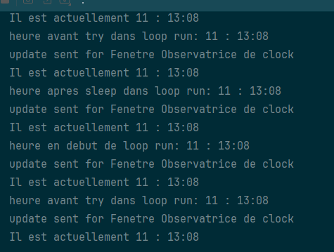

# Implémentation du Patron Observateur
### Entre une horloge qui s'update à la seconde et une fenêtre

Bug rencontré: le Sleep d'une seconde ne semble pas s'exécuter à chaque loop.

Aperçu de mon log:

